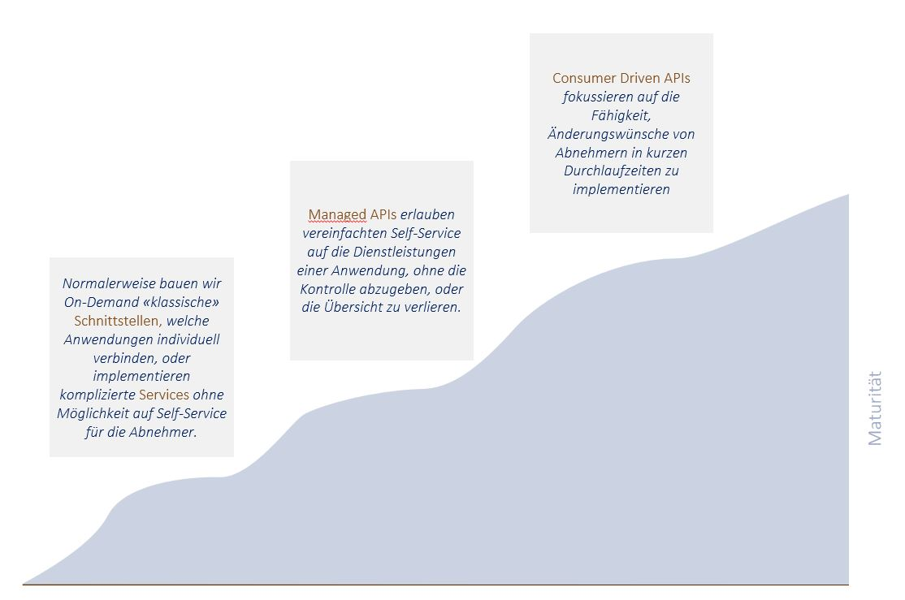

Maturity
========
{: .no_toc }

## Table of contents
{: .no_toc .text-delta }

1. TOC
{:toc}

---

## Continuous improvement of API Maturity
Severity: `Must`

Continuous effort in increasing the maturity of an API converning the *API Maturity Model*

#### Example
{: .no_toc }
*{coming soon}*

#### Rational
{: .no_toc }
Lower costs due to:
- Higher Speed on Development of API consumer applications
- Higher Reuse due to better understandability and quality

---

## APIs provide automated tests
Severity: `Must`

An API provides at least one integration stage with full functionality and *close-to-production* testdata.

#### Example
{: .no_toc }
*{coming soon}*

#### Rational
{: .no_toc }
Increased ...
- speed in implementing new features
- changeability and maintainability
- operational stability (e.g. less unknown side-effects)