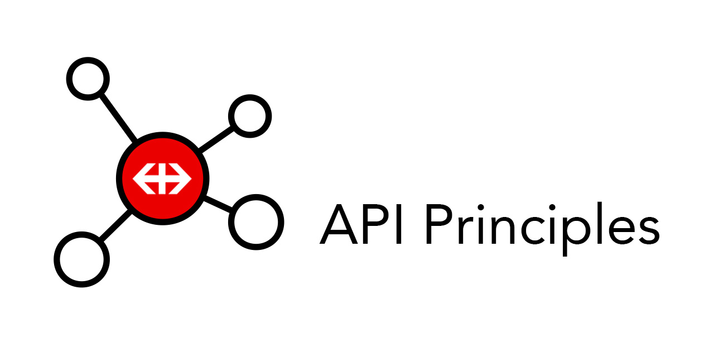
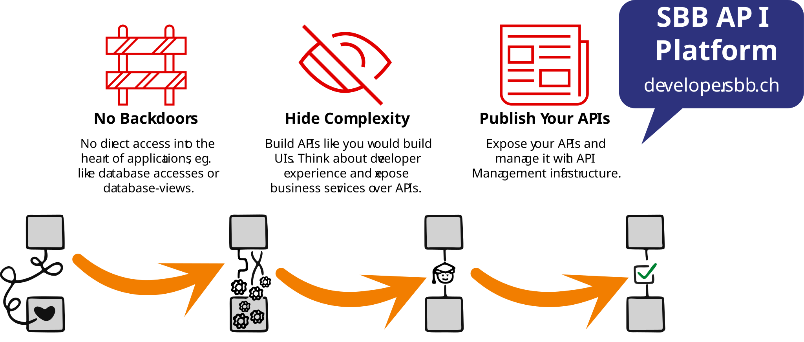

Version 2.4.0
{: .label .label-red}

Applications provide functionality via APIs, no matter if they are designed as Microservices or Monoliths. Their APIs purely express what the application does, and are therefore highly valuable business assets. Designing high quality, long lasting APIs has therefore become a business critical duty, which must be part of the development of every digitalized business capability or product. Our strategy emphasizes developing lots of internal APIs and also public APIs for our external business partners.

With this in mind, we’ve defined "API Principles" with the following key statements:

1. Every application publishes the data and functions of the business capabilities it mainly supports over an API with a defined [maturity](maturity/maturity)
1. APIs can be [synchronous](restful/restful) (RESTful) or asynchronous [Event-Driven](eventdriven/eventdriven)
1. Every API published on the [SBB API Repository](https://developer.sbb.ch) must fulfill the principles described on this site. Other APIs also must follow these guidelines, unless there are justifiable and strong reasons not to do so.

---

# Chapters

[Architecture](architecture)

[Organizational Aspects](organization/organizational-aspects)

[General Principles](general/general-principles)

[RESTful APIs](restful/restful)

[Event-Driven APIs](eventdriven/eventdriven)

[Changelog](CHANGELOG.md)

## API Principles in a nutshell

### We publish APIs

Every team publishes the data and functions of the business capabilities it is mainly responsible for as APIs, following these API Principles.

### API Driven Architecture

Always use APIs with a [maturity](organization/maturity) of at least _managed APIs_ as the boundary of your application.
That gives you control and visibility of traffic going in and out and encapsulates your business domain.

### Key Principles

1. We no longer build backdoors in applications.
1. We hide the complexity of our business domain within the application and design APIs the same way as we design UIs.
1. We make sure that the functional cut of APIs is alligned with the respective business capabilities and that each entity on the API has a unique identity (ID). We coordinate these design decisions tightly together with our business partners.
1. and finally, we document and publish our APIs on developer.sbb.ch so that they can be easily found, understood and used by others.

The following graphic shows the API principles in a nutshell.

## Conventions used in these guidelines

### Requirement level

The requirement level keywords `MUST` indicates that the principle or guideline is subject to SBB IT Governance and MUST be followed by all APIs listed in the [API Portfolio](https://sbb.sharepoint.com/sites/integration/Lists/API%20Portfolio/AllItems.aspx) _\[internal Link\]_. Principles marked as `SHOULD` OR `MAY` can be interpreted as best practices.

### API Consumer vs. Provider

_Consumer_ is used as a synonym for API Consumers (also known as clients of an API) and is referring the team which implements the client. On the other hand, we use _Provider_ as a synonym for _API Provider_, referring the team maintaining the API.

## Thank you

- To Zalando for the publication of their awesome set of [RESTful API Guidelines](https://opensource.zalando.com/restful-api-guidelines/) (we've learned a lot while reading and adopting them to our needs).
