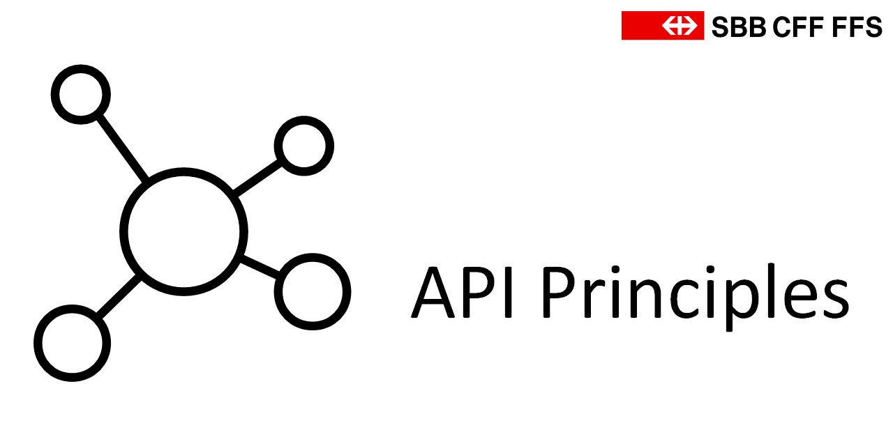

Version 1.3.0
{: .label .label-red}

Applications provide functionality via APIs, no matter if they are designed as Microservices or Monoliths. Their APIs purely express what systems do, and are therefore highly valuable business assets. Designing high quality, long lasting APIs has therefore become a business critical duty, which must be part of the development of every digitalized business capability or product. Our strategy emphasizes developing lots of internal APIs and also public APIs for our external business partners.

With this in mind, we’ve defined "API Principles" with the following key statements:

1. Every IT Solution publishes its main capabilities over an API with a high [maturity](maturity/maturity.md)
2. APIs can be [RESTful](restful/restful.md) or [Event-Driven](eventdriven/eventdriven.md)
3. Every API must fulfill the principles described on this site

---

Chapters
========
[Architecture](architecture.md)

[Organizational Requirements](organization.md)

[Maturity](maturity/maturity.md)

[RESTful APIs](synchronousdesign/synchronousdesign.md)

[Event-Driven APIs](asynchronousdesign/asynchronousdesign.md)

[API Security](security.md)

[Collaboration](collaboration.md)

API Principles in a nutshell
============================
#### We publish APIs
Every team publishes the data and functions of its most valuable business capabilities as APIs, following the common API Principles.

#### API Driven Architecture
Always use managed APIs as the boundary of your domain.
That gives you control and visibility of traffic going in and out.

#### Key Principles
(1) We no longer build backdoors in applications of other teams. (2) We hide the complexity of our business domain within the application and design APIs the same way as we design UIs. (3) We make sure that the functional cut of APIs is alligned with the according business capabilities and that each entity on the API has a unique identity (ID). We coordinate these design decisions tightly together with our business partners. (4) And finally, we document and publish our APIs on developer.sbb.ch so that they can be easily found, understood and used by others.

The following graphic shows the API principles in a nutshell.

Conventions used in these guidelines
====================================

#### Requirement level
The requirement level keywords `MUST` indicates that the principle or guideline is subject to SBB IT Governance and MUST be followed by all APIs listed in the API Portfolio ([internal Link](https://confluence.sbb.ch/display/AITG/API+Portfolio)). Principles marked as `SHOULD` OR `MAY` can be interpreted as best practices.

#### API Consumer vs. Provider
*Consumer* is used as a synonym for API Consumers (also known as clients of an API) and is referring the team which implements the client. On the other hand, we use *Provider* as a synonym for *API Provider*, referring the team maintaining the API.

Thank you
=========
- To Zalando for the publication of their awesome set of [RESTful API Guidelines](https://opensource.zalando.com/restful-api-guidelines/) (we've learned a lot while reading and adopting them to our needs).
