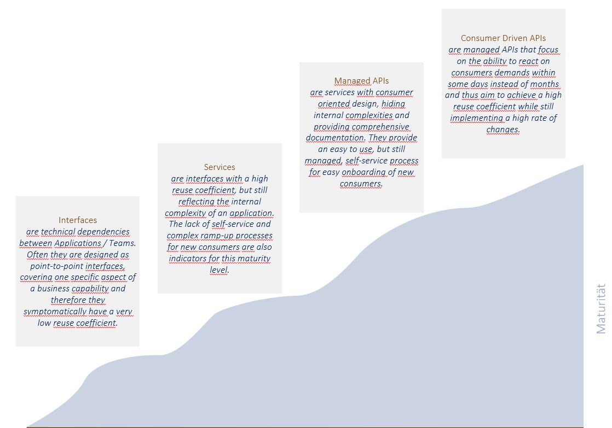

Maturity
========
{: .no_toc }

We have defined a maturity model in order to be able to differentiate between good and bad interfaces. This is an important precondition for the movement to better interfaces by fostering a high demanding API culture.

---

## Table of contents
{: .no_toc .text-delta }

1. TOC
{:toc}

---

## `MUST` Continuous improvement of API Maturity

APIs must invest a continuous effort in increasing the maturity of an API according to the *API Maturity Model*. 

#### Rational
{: .no_toc }

Higher maturities of interfaces lead to lower costs due to ...
- higher speed in the development of API consumers.
- higher reuse coefficient due to better understandability, quality and functional precision.

---

## `MUST` APIs provide automated tests

An API must provide at least one staging environment with full functionality and *close-to-production* testdata.

#### Rational
{: .no_toc }

A production-like testing environment increases ...
- speed in implementing new features in the API.
- changeability and maintainability rates.
- operational stability (e.g. less unknown side-effects).